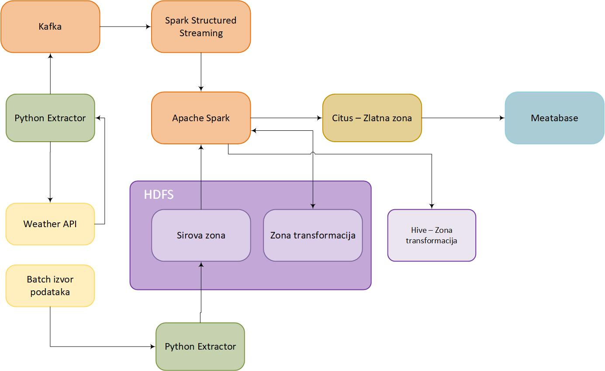

# Projekat ASVSP

**Predmet:** Arhitekture sistema velikih skupova podataka  

**Tema:**  
Analiza vremenskih podataka sa fokusom na prepoznavanje obrazaca i trendova u vremenskim događajima širom SAD,  
s ciljem dobijanja korisnih saznanja za različite zainteresovane strane.  

**Opis:**  
Poboljšanje razumevanja vremenskih trendova i njihovih efekata kroz analizu velikih skupova podataka  
i real-time informacija. Projekat koristi distribuiranu arhitekturu zasnovanu na savremenim alatima  
za obradu i vizualizaciju podataka.  

---

## Korišćene tehnologije

- **Apache Airflow** – orkestracija ETL procesa  
- **Apache Spark** – distribuisana obrada velikih skupova podataka  
- **Kafka** – streaming i real-time prenos podataka  
- **Hive** – skladištenje i upiti nad velikim dataset-ima  
- **Citus/Postgres** – relaciona baza podataka za analitičke upite  
- **Metabase** – vizualizacija podataka i izrada dashboard-a  
- **Hue** – interakcija sa Hadoop i Hive komponentama  

---

## Arhitektura sistema

---

## Dataset
Korišćen je javno dostupan skup podataka:  
[US Weather Events (Kaggle)](https://www.kaggle.com/datasets/sobhanmoosavi/us-weather-events)  
---
## Pitanja

### Operativni menadžer aerodroma

1.	Koliko sati je aerodrom bio izložen operativno rizičnim vremenskim uslovima na dnevnom nivou, i zatim dodati rolling metrike (30 i 90 dana).
   -   30 dana → pokazuje kratkoročni trend (mesec dana), korisno za operativne odluke (npr. raspored osoblja, nabavka soli za čišćenje snega).
   -	90 dana → daje sezonski trend, korisno za strateške odluke (planiranje resursa za čitavu zimu ili letnju sezonu).
2.	Za svaki aerodrom, i za svaki tip nepovoljnog uslova (Fog, Snow, Thunderstorm), koji su označeni kao (Moderate ili Heavy), prikazati najduži kontinuirani niz nepovoljnih uslova (uz sessionization gde se spajaju događaji sa pauzom  ≤ 60 minuta).
3.	Za svaki aerodrom prikazati koliko sati se, na tom aerodromu, u preklapajućem intervalu, javljaju kombinacije vremenskih uslova (npr. Fog + Rain), na dnevnom nivou ?
4.	Za svaki aerodrom, prikazati najintenzivniji tročasovni period rizika svakog dana (koliko minuta u bilo kojem kliznom prozoru od 3 sata na dnevnom nivou). Ovo otkriva „udarne periode“ koji stvaraju najveći pritisak na operacije.
5.	Za svaki aerodrom i za svaki tip vremenskog događaja  izračunati prosečno trajanje i broj događaja po mesecima, zajedno sa procentualnom promenom u odnosu na prethodni mesec, kako bi se pratio trend i olakšalo planiranje resursa.

### Državni menadžer zimske službe
1. **Workload indeks (DOT menadžer zimske službe)**  
   Izračunava se po okrugu i mesecu, sa trendovima, pokretnim prosekom i rangiranjem,  
   kako bi se planirala potrošnja soli, organizacija smena i premeštanje ekipa.  

   Formula:  

   $$
   W(y, m, c) = \sum_{i \in E(y, m, c)} \left( \frac{d_i}{60} \times w_{sev}(s_i) \times w_{type}(t_i) \right)
   $$

   **Gde je:**
   - \(E(y,m,c)\) – skup svih vremenskih događaja u okrugu \(c\) tokom meseca \(m\) godine \(y\)  
   - \(d_i\) – trajanje događaja *i* u minutima  
   - \(s_i\) – ozbiljnost (*severity*) događaja *i*  
   - \(t_i\) – tip događaja (Snow, Ice, Cold, …)  
   - \(w_{sev}(s_i)\) – težinski koeficijent za ozbiljnost (*Light=1, Moderate=2, Heavy=3, Other=1*)  
   - \(w_{type}(t_i)\) – težinski koeficijent za tip (*Snow=3, Ice=2, Cold=1, ostalo=0*)  

---

2. **Detekcija vremenskih sekvenci**  
   - Sekvenca tipa: **RAIN → COLD → SNOW**  
   - U okviru istog okruga i vremenskog prozora od **48 sati**  
   - Mera: trajanje sekvence u satima  
   - Korisno za prepoznavanje potencijalno opasnih obrazaca (npr. crni led)  

---

3. **Identifikacija epizoda zimskih događaja (SNOW/ICE/COLD)**  
   - Epizoda = niz događaja između kojih nema prekida dužeg od **6h**  
   - Za svaku epizodu izračunava se:  
     - početak  
     - kraj  
     - trajanje  
     - razmak u odnosu na prethodnu epizodu  

   **Agregati po state+county+godina:**  
   - ukupan broj epizoda  
   - broj epizoda dužih od 12h  
   - prosečan razmak između epizoda (*avg interepisode gap*)  
   - prosečno trajanje epizoda  
   - maksimalno trajanje epizoda  

---

4. **Operativni rizik noćnih oluja (STORM)**  
   Kombinuju se učestalost, trajanje i ozbiljnost.  
   - ukupan broj STORM događaja (dan + noć)  
   - broj STORM događaja noću  
   - udeo noćnih događaja u svim olujama  
   - prosečno trajanje noćnih oluja (sati)  
   - prosečna ozbiljnost noćnih oluja (*Light=1, Moderate=2, Heavy=3*)  
   - prosečno trajanje noćnih oluja (računato na osnovu poslednja 3 meseca, za svaki state+county)  

---

5. **Analiza fenologije zimske sezone**  
   Za svaku kombinaciju *state + county + season_year* izračunava se:  
   - datum i vreme **prvog** zimskog događaja (SNOW/ICE/COLD)  
   - datum i vreme **poslednjeg** zimskog događaja  
   - trajanje operativne zime u danima (razlika poslednji − prvi događaj)  
   - pomak početka zime u odnosu na prethodnu sezonu  
     - negativno = ranije  
     - pozitivno = kasnije  
   - pomak završetka zime u odnosu na prethodnu sezonu  
     - negativno = ranije  
     - pozitivno = kasnije  
   - promena ukupne dužine zime u odnosu na prethodnu sezonu  
     - pozitivno = duža  
     - negativno = kraća  
   - klizeći trogodišnji prosek dužine zime (ublažava oscilacije, pokazuje trend)  

